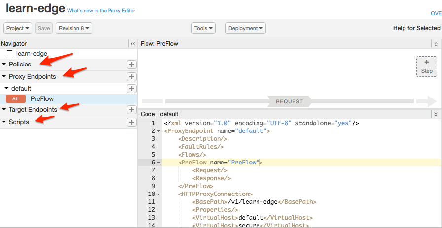

# The simplest proxy

This is the first example in the Learn Edge series. In this example, you will deploy a simple API proxy on Apigee Edge. Actually, this is the simplest proxy you can make -- it doesn't actually do anything! But it does return a 200 response to let you know it's deployed properly. 

In the next few examples, we'll add features to this proxy. 

### Prerequisites

Be sure to perform the [prerequisites](https://github.com/apigee/api-platform-samples/tree/master/learn-edge#prerequisites) if you haven't already.

### Deploy it

1. **Final reminder:** You must have [apigeetool](https://www.npmjs.com/package/apigeetool) installed on your machine, as explained in the [prerequisites](https://github.com/apigee/api-platform-samples/tree/master/learn-edge#prerequisites).

2. `cd api-platform-samples/learn-edge/simplest-proxy`.

3. `./deploy.sh` 
    
    > Note: It's not important to deconstruct `deploy.sh` now. It just uses a command-line utility (apigeetool) to deploy the proxy. The first time you run deploy.sh, you'll be asked to provide your organization, environment, username, and other Apigee account details. This information is stored in a file `~\.learn-edge.rc`, which `deploy.sh` references on subsequent calls. You only need to enter your account information once unless you delete the `learn-edge.rc` file. 

### Run it

1. `./invoke.sh`

    This script executes this curl command: 

    `curl http://<your org name>-<your environment>.apigee.net/v1/learn-edge`

    where "your org name" is the name of your Apigee Edge organization and "your environment" is the name of the environment to deploy to. These values are the ones you set in `api-platform-samples/tools/setup/setenv.sh`.

2. Look at the output.

    Did you get back a Status 200? Perfect! The proxy is deployed and able to accept requests. In [proxy-to-a-target](./proxy-to-a-target), we'll make a few simple changes so the proxy calls an actual backend service.

### Trace it

In every Learn Edge example, we'll remind you to trace API calls in the Edge UI. Here are the basic steps that you'll repeat again and again:

1. Log in to your Apigee account. 
2. Go to **APIs->API Proxies**. 
5. Click the proxy named **learn-edge**. 
6. In the **Overview** tab, notice that the Proxy URL is `http://<your org name>-test.apigee.net/v1/learn-edge`. This is the Proxy URL: you will use this URL to call the proxy. 
7. Click the **Develop** tab. This is the UI-based development environment for proxies.  
8. Click the **Trace** tab to go to the Trace Tool.
9. Click **Start Trace**. 
10. Send a request with the `invoke.sh` script.
11. Click around the Trace "Transation Map". Notice that in each part of the flow you'll see output showing you information about the request such as headers and message content, any context variables that are read or set during processing, and so on. 

**Hint:** Trace is a valuable tool for debugging proxies. It shows you what's happening while requests and responses pass through the Edge pipeline.

### What you did

You deployed a basic proxy to Edge, called it, and got a 200 response. This may seem trivial, but you accomplished several important tasks. You deployed an Edge proxy from your work computer to Edge, you called the API proxy, and got back meaningful output. You also poked around the Edge UI and ran a Trace. 

### Extra reading: Important terms and concepts

* An **API proxy** is an API that fronts for another API. In the next example, we'll route a request to a backend target. In later examples, we'll implement policies to enforce security, do caching, fault handling, and much more.
* This is the basic file structure for all Edge API proxies:

   ```
   /apiproxy
      /proxies
      /targets
      /policies
      /resources
      proxyname.xml
   ```

    Note that in this "simplest-proxy" example, targets, policies, and resources are empty directories, because they aren't used. In later examples, these other directories, and their contents, will be important.

* This file structure is mapped into the Edge UI, although the UI uses slightly different names for the components. For example, **Policies** maps to your local `/policies` directory. **Proxy Endpoints** maps to the `/proxies` directory, and **Scripts** maps to `/resources`. 



* Many developers develop proxies locally and deploy them using a command line tool (like `apigeetool` that is used in the `./deploy.sh` file) or tools like Maven or Grunt. It's all about properly packaging and uploading the local files to Edge. You can even package a proxy in a ZIP file and upload it through the Edge UI. 

### Next step

The next proxy, [proxy-to-a-target](../proxy-to-a-target/README.md), returns data from a backend service. 

### Ask the community

[](https://community.apigee.com?via=github)

---

Copyright © 2016 Apigee Corporation

Licensed under the Apache License, Version 2.0 (the "License"); you may not use
this file except in compliance with the License. You may obtain a copy
of the License at

http://www.apache.org/licenses/LICENSE-2.0

Unless required by applicable law or agreed to in writing, software
distributed under the License is distributed on an "AS IS" BASIS,
WITHOUT WARRANTIES OR CONDITIONS OF ANY KIND, either express or implied.
See the License for the specific language governing permissions and
limitations under the License.
