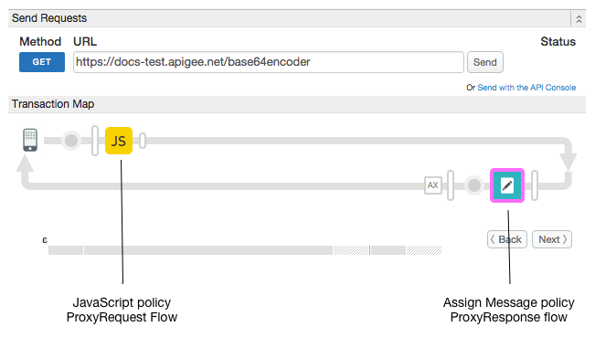

# Using third-party JavaScript libraries

  

### Sample use case

How to use include third-party libraries in JavaScript policies.

### About

In a JavaScript policy, you can load JavaScript files as dependencies to the main JavaScript file. Here's how the JavaScript policy looks in this sample, where `encodeAuthHeader.js` is the main JavaScript file. 

```
    <Javascript timeLimit="200" name="EncodeAuthHeader">
        <DisplayName>EncodeAuthHeader</DisplayName>
        <IncludeURL>jsc://core-min.js</IncludeURL>
        <IncludeURL>jsc://enc-utf16-min.js</IncludeURL>
        <IncludeURL>jsc://enc-base64-min.js</IncludeURL>
        <ResourceURL>jsc://encodeAuthHeader.js</ResourceURL>
    </Javascript>
```

The included scripts are evaluated in the order in which they are listed in the policy. Any of the dependent code can use the objects, methods, and properties of the Apigee Edge [JavaScript object model](http://apigee.com/docs/api-services/reference/javascript-object-model).

This demo uses code from the third-party CryptoJS module to do base64 encoding on the user name and password presented in the request. 

### Set up, deploy, invoke

See the main project [README](../../README.md) file for information about setting up, deploying, and invoking sample proxies. 

>If you open `invoke.sh` take a look at the cURL call:
>
>`curl -i "https://$org-$env.$api_domain/base64encoder?username=MyUserName&password=MyPassword"`
>
>It just passes arbitrary username and password strings. You can change them if you want, but they aren't actually validated by this sample. The JavaScript policy grabs whatever values are presented and base64 encodes them. 

### Result

An Assign Message policy echoes the encoded value back to the client as a custom HTTP header. 

```
    HTTP/1.1 200 OK
    User-Agent: curl/7.37.1
    Host: docs-test.apigee.net
    Accept: */*
    X-Encoded-Credentials: Basic TXlVc2VyTmFtZTpNeVBhc3N3b3Jk
    Content-Length: 0
    Connection: keep-alive
```

### Trace

This screen shot from the [Apigee Edge trace tool](http://apigee.com/docs/api-services/content/using-trace-tool-0) shows the placement of the policies used in this sample. 

 

### More information

**Policy used in this sample**

* [JavaScript policy](http://apigee.com/docs/api-services/reference/javascript-policy)
* [Assign Message policy](http://apigee.com/docs/api-services/reference/xml-json-policy)

### Ask the community

[](https://community.apigee.com?via=github)

---

Copyright © 2015 Apigee Corporation

Licensed under the Apache License, Version 2.0 (the "License"); you may not use
this file except in compliance with the License. You may obtain a copy
of the License at

http://www.apache.org/licenses/LICENSE-2.0

Unless required by applicable law or agreed to in writing, software
distributed under the License is distributed on an "AS IS" BASIS,
WITHOUT WARRANTIES OR CONDITIONS OF ANY KIND, either express or implied.
See the License for the specific language governing permissions and
limitations under the License.

