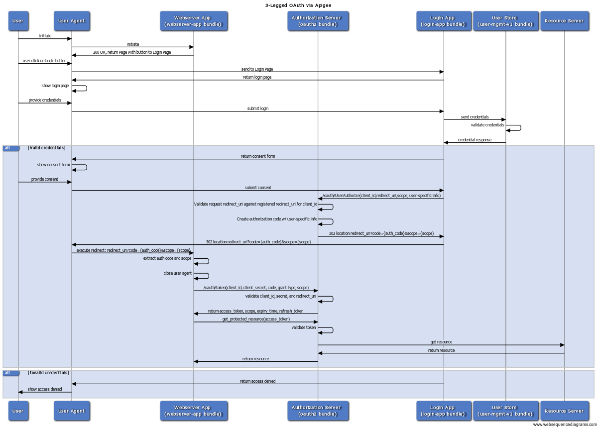
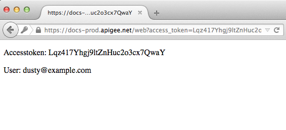

# Authorization code grant type example

This is a complete, working example that demonstrates an approach to implementing the OAuth 2.0 authorization code grant type with Apigee Edge as the authorization server.

> If you are not familiar with OAuth 2.0 and terms like "grant type" and "authorization server", there are many resources available on the web. We recommend you start with the [IETF specification](https://tools.ietf.org/html/draft-ietf-oauth-v2-31). It includes a good, general introduction to the OAuth 2.0 framework and its use cases.

* [What you need to know about this example](#needtoknow)
* [What are the parts of this example?](#parts)
* [How do I get it?](#howdo)
* [Prerequisites](#prerequisites)
* [Required configuration steps](#configuration)
* [Test the sample](#deploy)
* [Clean up](#clean)
* [About login and consent session management](#session)

## <a name="needtoknow">What you need to know about this example

The authorization code grant type requires a step where the end user logs in to the resource server (where protected resources owned by the user are stored) and then gives explicit consent for the app to access those resources. The key to this flow is that the client app never gets to see the user's login credentials for the protected resources, as the authorization on the resource server is handled between the user, the resource server, and the OAuth authorization server.

Here's a flow diagram outlining the steps of this flow:

**TIP**: Save the graphic to your system and open it locally to see the full size image.  You can also use the text provided in ./api-platform-samples/sample-proxies/oauth-advanced/misc/webSequenceDiagram.txt and plug into `https://www.websequencediagrams.com`.



1. User initiates the flow by clicking a button in a web page.
2. The user's browser is redirected to a login page. This login page is not under the control of the client app. The client app does not participate in the login interaction, and the client app never sees the user's username or password.
3. If login is successful, the user is directed to a consent page. The consent page allows the user to specify scopes (what the client app is authorized to do with on behalf of the user).
4. After consent is given, the login app communicates with the authorization server. If redirect_URI matches the redirect_URI in Apigee Edge for that client_id, the authorization server generates an authorization code and sends it back to the client app (via a previously specified redirect URI).
5. The client app now has an authorization code and uses it to ask the authorization server for an access token.
6. Upon receiving an access token, the client app is able to access the protected APIs on the resource server by including the access token with each call.

## <a name="parts">What are the parts of this example?

This example has the following parts:

* **login-app** -- A complete implementation that includes a login page and a consent page. Implements session management for extra security. Essentially, this is an API proxy deployed on Apigee Edge. Most of the implementation is in Node.js. For information on the session management feature, see `login-app/README`.
* **user-mgmt-v1** -- A key/value store implementation for storing the user's login information. Implemented as an API proxy and deployed on Apigee Edge. An interface to any user management system could be plugged in here, such as LDAP.
* **webserver-app** -- A very simple web page implemented as an API proxy (runs on Apigee Edge to simplify this example). This is the client app -- the target of the redirect URL to which tokens and other information are sent from the authorization server. Note that this client app never sees the user's login credentials for the resource server.
* **oauth2** -- An API proxy deployed on Apigee Edge that implements the OAuth 2.0 token endpoints. This is the Apigee Edge authorization server interface. Think of this as a service for requesting and managing OAuth tokens.

>Note that all the parts of this example run on Apigee Edge. For the most part, this is just to simplify things. The login app, for example, could be designed to run on any platform, as long as it can communicate with Apigee Edge (the authorization server). Such details are obviously going to vary depending on the specific bundle.


## <a name="howdo"></a>How do I get it?

#### 1) Clone this repository from Git
```bash
  $ git clone https://github.com/apigee/api-platform-samples
```

When you have the samples repository on your system, CD to `./api-platform-samples/sample-proxies/oauth-advanced`. This puts you in the root directory of this example.

## <a name="prerequisites">Prerequisites

To run this sample, you'll need:

* The username and password that you use to login to `enterprise.apigee.com`.

* The name of the organization in which you have an account. Login to
  `enterprise.apigee.com` and check account settings.

## <a name="configuration">Required configuration steps

The following sections step through configuration of each example component.

### Before you start

1. Open `./api-platform-samples/setup/setenv.sh` and add your Apigee Edge account information. The sample components will be deployed to the organization specified in this file.

```sh
    org="The name of your organization on Apigee Edge"
    username="The email address of your Apigee Edge account"
    url="https://api.enterprise.apigee.com"
    env="The environment on Edge to deploy to (prod or test)"
    api_domain="apigee.net"
```

### Deploy the user-mgmt-v1 bundle

This bundle does not require any configuration. Just deploy it:

1. CD to the root directory of the `user-mgmt-v1` bundle: `user-mgmt-v1`.
2. Execute: `./deploy.sh`

### Configure and deploy the oauth2 bundle

This bundle requires a small configuration, and it also requires that these entities be created on Apigee Edge: a developer, a product, and a developer app. We have a script that will create these automatically for you. These must be in place before you deploy the bundle.

Here are the steps:

**Deploy the oauth2 API bundle:**

1. CD to `oauth2`
2. Execute: `./deploy.sh`


**Provision the required entities to Apigee Edge:**

You must perform this step after you deploy the oauth2 API bundle.

1. CD to `oauth-advanced/provisioning`
2. Open the file `oauth2-app.xml` in an editor.
3. Edit the ```<CallbackUrl>``` element as follows, substituting your Edge organization and environment names:

    <CallbackUrl>https://org-env.apigee.net/web/callback<CallbackUrl>

    for example:

    <CallbackUrl>https://myorg-test.apigee.net/web/callback<CallbackUrl>

    **Important:** Make a note of this exact callback URL. You will need to add it to another configuration file later.

4. Execute: `./provision-oauth2.sh`

The provisioning script creates the required entities on Apigee Edge and returns two keys: **Consumer key** and **Consumer secret** in your terminal window. You'll need these values when you configure the webserver app.

**TIP**: You can log in to the Apigee Edge UI and see that the developer, product, and app entities were created.

###Configure and deploy the webserver-app bundle


1. Open `webserver-app/apiproxy/policies/SetConfigurationVariables.xml`

2. Enter your values for `appKey`, `appSecret`, `environment`, and `organization`, as shown below.

>**Important! You'll need to grab the Consumer ID and Consumer Secret that were returned when you provisioned the `oauth2-*` entities in the previous step. Substitute those values in for the `appKey` and `appSecret`.**

For example:

    ```xml
          <AssignMessage async="false" continueOnError="false" enabled="true" name="SetConfigurationVariables">
              <DisplayName>SetConfigurationVariables</DisplayName>
              <FaultRules/>
              <Properties/>
              <AssignVariable>
                  <Name>appKey</Name>
                  <Value>Substitute the Consumer key</Value>
              </AssignVariable>
              <AssignVariable>
                  <Name>appSecret</Name>
                  <Value>Substitute the Consumer secret</Value>
              </AssignVariable>
              <AssignVariable>
                  <Name>config.environment</Name>
                  <Value>Substitute your Edge environment (prod or test)</Value>
              </AssignVariable>
              <AssignVariable>
                  <Name>config.organization</Name>
                  <Value>Substitute your organization name on Edge</Value>
              </AssignVariable>
              <AssignVariable>
                  <Name>config.domain</Name>
                  <Value>apigee.net</Value>
              </AssignVariable>
              <AssignVariable>
                  <Name>config.protocol</Name>
                  <Value>https</Value>
              </AssignVariable>
              <IgnoreUnresolvedVariables>false</IgnoreUnresolvedVariables>
          </AssignMessage>
    ```

3. Save the file.
4. Open `webserver-app/apiproxy/policies/HTMLIndex.xml`
5. Edit the `BASEURL`, `REDIRECT`, and `CLIENT_ID` variables as follows:

  * `BASEURL` - The base URL for your environment -- use your organization and environment names on Edge. For example: https://myorg-prod.apigee.net.
  * `REDIRECT` - This is the Redirect URI.

      **Note** This URI must *exactly match* the CallbackUrl element that you added to the `oauth2-app.xml` configuration previously. For example: `https://myorg-test.apigee.net/web/callback`

  * `CLIENT_ID` - The "Consumer Key" obtained from a developer app that is registered on Apigee Edge. **Note!** This key  must match the one you configured previously in the webserver app.
6. Save the file.

**Deploy the webserver-app bundle:**

1. CD to `webserver-app`
2. Execute: `./deploy.sh`

## Configure and deploy the login-app bundle

**Provision the required entities to Apigee Edge:**

You must perform this step before you configure the login-app bundle.

1. CD to `oauth-advanced/provisioning`
2. Execute: `./provision-login-app.sh`

**TIP**: You can log in to the Apigee Edge UI and see that the developer, product, and app entities were created.

**Configure the bundle:**

1. CD to the `oauth-advanced/login-app/apiproxy/resources/node` directory.
2. Execute `npm install` to install dependencies.
3. Open `login-app/apiproxy/resources/node/config/config.js`
4. Enter your environment information. The domain will typically be `apigee.net`. Some on-premise installations of Apigee Edge may use a different domain. For example:

      ```
          exports.envInfo = {
             org: 'Your org name on Edge',
             env: 'Your environment on Edge (test or prod)',
             domain: 'apigee.net'
          };
      ```

5. Save the file.

**Deploy the login-app bundle:**

1. CD to `login-app`
2. Execute: `./deploy.sh`

## <a name="deploy">Test the sample

1. Open a browser and go to this URL:

    `http://myorg-myenv.apigee.net/web`

    For example:

    `http://jdoe-prod.apigee.net/web`

2. Initiate the flow.  Just click the "Login with Apigee Example Auth" button. This action sends a request to the authorization server (Apigee Edge), which redirects the browser to a login page.

3. If you haven't registered, do so. Otherwise, log in.

    >**NOTE:** There's a bug (#42) where certain passwords cause the registration to fail (throw a stacktrace error). For example, a password like 566559aa throws an error, while apigee123 does not. Until further notice, when trying out this sample, try using apigee123 as your password if see an error like this when you click the "Register" button.

4. Give consent.  The consent page gives you (the end user) a chance to limit the type of access the app will have to your resources. In this example, only one scope is offered, called "order". Click **Allow** to give the app access to your resources.

5. Retrieve the access token.  After you give consent, these things happen behind the scenes (refer to the flow diagram above for more a graphical view):

* The login app communicates to the authorization server that the login was successful.
* The authorization server generates an authorization code and returns it to the app.
* The app puts the code into a request to the authorization server for an access token. The app also supplies the client ID and client secret keys.
* The authorization server validates the auth code and other credentials, and if everything is okay, it returns an access token back to the client.
* Now, with an access token, the client can request resources from the protected API.

>It's important to see that the app never saw the user's username and password entered in the login page.

If everything worked okay, you'll see the access code and some extra information (the user's name) displayed in the user's browser:



## <a name="clean">Clean up

You can use the cleanup scripts to remove the entities (developers, apps, products) that were installed with this sample.

1. CD to `oauth-advanced/provisioning`
2. Execute `cleanup-login-app.sh`
3. Execute `cleanup-oauth2.sh`

## <a name="session">About login and consent session management

The login app includes session management to guarantee that only the logged-in user can access the consent page. Once a successful login has occurred, a user attribute is set in the server side session data.  This attribute is checked when clients access the consent page.  A valid logged-in session can only be used one time for consent to an authorization.  The session is destroyed upon a successful consent in which an authorization code is generated for the client application. For more information, see `./login-app/README`.

## Get help

For assistance, please use [Apigee Support](https://community.apigee.com/content/apigee-customer-support).

Copyright © 2014, 2015 Apigee Corporation

Licensed under the Apache License, Version 2.0 (the "License"); you may not use
this file except in compliance with the License. You may obtain a copy
of the License at

http://www.apache.org/licenses/LICENSE-2.0

Unless required by applicable law or agreed to in writing, software
distributed under the License is distributed on an "AS IS" BASIS,
WITHOUT WARRANTIES OR CONDITIONS OF ANY KIND, either express or implied.
See the License for the specific language governing permissions and
limitations under the License.
