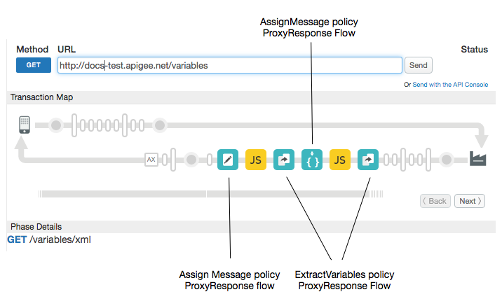

# Extract and assign variables

### Sample use case

Extract variables from an XML and JSON response messages. Assign variables to HTTP response headers.

### Policies 

This sample uses these policies: 

*  Extract Variables: To pull subsets of data from the response body.  
*  XML to JSON: To convert the response from XML to JSON.
*  Assign Message: To assign extracted data to response headers. 
*  Reads extracted variables so they are visible in the Trace tool. 

### About

1. Extract variables from the XML response sent from the target. Use XPath syntax to identify the data to extract. 
2. Use JavaScript policy to read the variables. This allows them to show up in the Trace tool. 
2. Convert the response payload from XML to JSON.
3. Extract more variables from the converted JSON payload. Use JSONPath syntax to identify the data to extract. 
4.  Use JavaScript policy to read the variables. This allows them to show up in the Trace tool. 
4. Assign the extracted variables to HTTP response headers. 

### Set up, deploy, invoke

1. Edit this script with your environment details: `api-platform-samples/setup/setenv.sh`

2. `./deploy.sh`

3. `invoke.sh`

See the main project [README](../../README.md) file for more detailed information about setting up, deploying, and invoking sample proxies. 

### Trace

This screen shot from the [Apigee Edge trace tool](http://apigee.com/docs/api-services/content/using-trace-tool-0) shows the placement of the policies used in this sample. 

### More information

**Related policies**

* [JSON to XML policy](http://apigee.com/docs/api-services/reference/json-xml-policy)
* [XSL transform policy](http://apigee.com/docs/api-services/reference/xsl-transform-policy)

**Related topics**

* [Variables reference](http://apigee.com/docs/api-services/reference/variables-reference)
* [Introduction to flow variables](http://apigee.com/docs/api-services/content/introduction-flow-variables)
* [Using Extract Variables policy video](https://www.youtube.com/watch?v=arVPRaL4qQk)

### Ask the community

---

Copyright © 2016 Apigee Corporation

Licensed under the Apache License, Version 2.0 (the "License"); you may not use
this file except in compliance with the License. You may obtain a copy
of the License at

http://www.apache.org/licenses/LICENSE-2.0

Unless required by applicable law or agreed to in writing, software
distributed under the License is distributed on an "AS IS" BASIS,
WITHOUT WARRANTIES OR CONDITIONS OF ANY KIND, either express or implied.
See the License for the specific language governing permissions and
limitations under the License.
