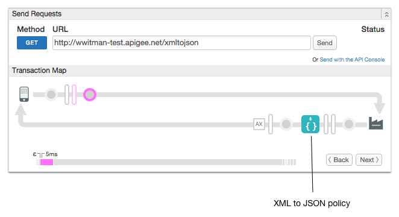

# XML to JSON Transformation


### Sample use case

Convert an XML-formatted response to JSON. 

### Policies 

This sample uses this policy: 

*  XML to JSON: to transform the response from XML to JSON format. 

### About

The sample API proxy calls a backend weather service that returns weather data in XML format by default. We use the XML to JSON policy on the response flow to transform the response to JSON. 

### Set up, deploy, invoke

See the main project [README](../../README.md) file for information about setting up, deploying, and invoking sample proxies. 

### Result

Weather information for Palo Alto, CA in JSON format. Tip: To get nicely formatted JSON like below, you can try piping the command to a formatting utility. For example: `curl <command> | python -mjson.tool`

```
{
    "rss": {
        "channel": {
            "astronomy": {
                "sunrise": "6:46 am",
                "sunset": "7:23 pm"
            },
            "atmosphere": {
                "humidity": "69",
                "pressure": "29.89",
                "rising": "1",
                "visibility": ""
            },
            "description": "Yahoo! Weather for Palo Alto, CA",
            "image": {
                "height": "18",
                "link": "http://weather.yahoo.com",
                "title": "Yahoo! Weather",
                "url": "http://l.yimg.com/a/i/brand/purplelogo//uh/us/news-wea.gif",
                "width": "142"
            }
...
```

### Trace

This screen shot from the [Apigee Edge trace tool](http://apigee.com/docs/api-services/content/using-trace-tool-0) shows the placement of the policies used in this sample. 



### More information

**Policy used in this sample**
* [XML to JSON policy](http://apigee.com/docs/api-services/reference/xml-json-policy)

**Related policies**
* [JSON to XML policy](http://apigee.com/docs/api-services/reference/json-xml-policy)
* [XSL transform policy](http://apigee.com/docs/api-services/reference/xsl-transform-policy)

### Ask the community

[](https://community.apigee.com?via=github)

---

Copyright © 2015 Apigee Corporation

Licensed under the Apache License, Version 2.0 (the "License"); you may not use
this file except in compliance with the License. You may obtain a copy
of the License at

http://www.apache.org/licenses/LICENSE-2.0

Unless required by applicable law or agreed to in writing, software
distributed under the License is distributed on an "AS IS" BASIS,
WITHOUT WARRANTIES OR CONDITIONS OF ANY KIND, either express or implied.
See the License for the specific language governing permissions and
limitations under the License.
